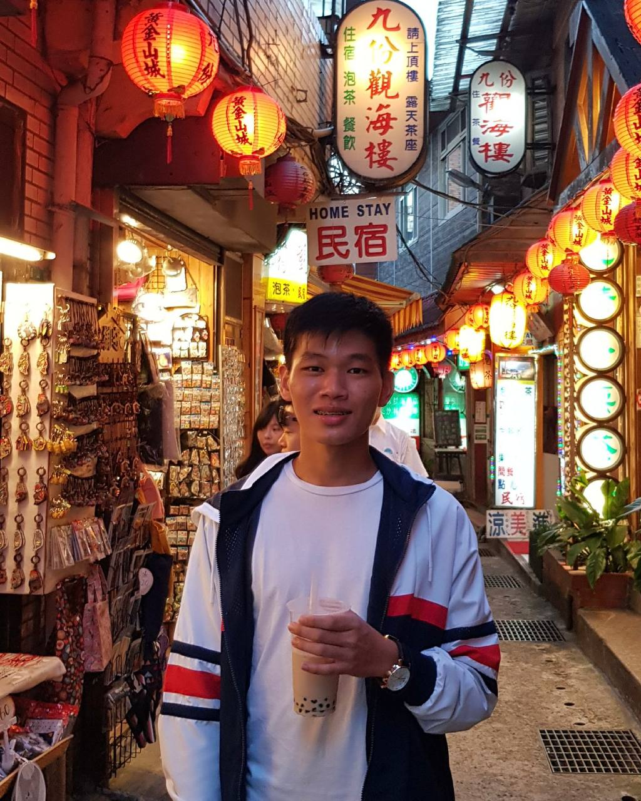

We are a team based in the [School of Computing, National University of Singapore](http://www.comp.nus.edu.sg).

## Project team

### Andy Lam Wei Jie

[[github](https://github.com/lamwj98)]
[[portfolio](team/lamwj98.md)]

- Role:
  - Refactor code base
  - Integration
  - In charge of `Model`

### Loh Wei Ming, Darin

[[github](http://github.com/talkintomato)]
[[portfolio](team/talkintomato.md)]

- Role:
  - Documentation
  - Developer
  - Deliverables
  - In charge of `Expense Categories`
  
### Tham Jin Lin

[[github](http://github.com/jltham)]
[[portfolio](team/jltham.md)]

- Role:
  - Scheduling and tracking
  - Code Quality
  - In charge of `Storage`

### Ria Khaitan

[[github](http://github.com/riakhaitan)] [[portfolio](team/riakhaitan.md)]

- Role:
  - Developer
  - Documentation and deliverables
  - Deadlines

### Shivang Gupta

[[github](http://github.com/Shivang211)]
[[portfolio](team/shivang211.md)]

- Role:
  - Developer
  - Documentation
  - UI and Testing
