## Table of Contents

- [Table of Contents](#table-of-contents)
- [**Acknowledgements**](#acknowledgements)
- [**Setting up, getting started**](#setting-up-getting-started)
- [**Design**](#design)
  - [Architecture](#architecture)
  - [UI component](#ui-component)
  - [Logic component](#logic-component)
  - [Model component](#model-component)
  - [Storage component](#storage-component)
  - [Common classes](#common-classes)
- [**Implementation**](#implementation)
  - [**Filter**](#filter)
    - [_How is the feature implemented?_](#how-is-the-feature-implemented)
    - [_Why is it implemented this way_](#why-is-it-implemented-this-way)
    - [_Alternatives considered_](#alternatives-considered)
  - [**Navigating through command history**](#navigating-through-command-history)
    - [_How is the feature implemented?_](#how-is-the-feature-implemented-1)
    - [_Why is it implemented this way_](#why-is-it-implemented-this-way-1)
    - [_Alternatives considered_](#alternatives-considered-1)
  - [**Adding a person to the person list**](#adding-a-person-to-the-person-list)
    - [_How is the feature implemented?_](#how-is-the-feature-implemented-2)
    - [_Why is it implemented this way_](#why-is-it-implemented-this-way-2)
    - [_Alternatives considered_](#alternatives-considered-2)
  - [**Updating the amount of a person**](#updating-the-amount-of-a-person)
    - [_How is the feature implemented?_](#how-is-the-feature-implemented-3)
    - [_Why is it implemented this way_](#why-is-it-implemented-this-way-3)
    - [_Alternatives considered_](#alternatives-considered-3)
  - [**Getting Help**](#getting-help)
    - [Implementation](#implementation-1)
    - [Design considerations:](#design-considerations)
  - [**AddCat Command**](#addcat)
    - [_How is the feature implemented?_](#how-is-the-feature-implemented-4)
    - [_Why is it implemented this way_](#why-is-it-implemented-this-way-4)
  - [**ListCat Command**](#listcat)
    - [_How is the feature implemented?_](#how-is-the-feature-implemented-5)
- [**Documentation, logging, testing, configuration, dev-ops**](#documentation-logging-testing-configuration-dev-ops)
- [**Appendix: Requirements**](#appendix-requirements)
  - [Product scope](#product-scope)
  - [User stories](#user-stories)
  - [Use cases](#use-cases)
  - [Non-Functional Requirements](#non-functional-requirements)
  - [Glossary](#glossary)
- [**Appendix: Instructions for manual testing**](#appendix-instructions-for-manual-testing)
  - [Launch and shutdown](#launch-and-shutdown)
  - [Adding an expense](#adding-an-expense)
  - [Deleting an expense](#deleting-an-expense)

---

## **Acknowledgements**

- This project is based on the AddressBook-Level3 project created by the [SE-EDU initiative](https://se-education.org).

---

## **Setting up, getting started**

Refer to the guide [_Setting up and getting started_](SettingUp.md).

---

## **Design**

:bulb: **Tip:** The `.puml` files used to create diagrams in this document can be found in the [diagrams](https://github.com/se-edu/addressbook-level3/tree/master/docs/diagrams/) folder. Refer to the [_PlantUML Tutorial_ at se-edu/guides](https://se-education.org/guides/tutorials/plantUml.html) to learn how to create and edit diagrams.

### Architecture

The **_Architecture Diagram_** given above explains the high-level design of the App.

Given below is a quick overview of main components and how they interact with each other.

**Main components of the architecture**

**`Main`** has two classes called [`Main`](https://github.com/AY2122S2-CS2103T-W09-3/tp/blob/master/src/main/java/seedu/address/Main.java) and [`MainApp`](https://github.com/AY2122S2-CS2103T-W09-3/tp/blob/master/src/main/java/seedu/address/MainApp.java). It is responsible for,

- At app launch: Initializes the components in the correct sequence, and connects them up with each other.
- At shut down: Shuts down the components and invokes cleanup methods where necessary.

[**`Commons`**](#common-classes) represents a collection of classes used by multiple other components.

The rest of the App consists of four components.

- [**`UI`**](#ui-component): The UI of the App.
- [**`Logic`**](#logic-component): The command executor.
- [**`Model`**](#model-component): Holds the data of the App in memory.
- [**`Storage`**](#storage-component): Reads data from, and writes data to, the hard disk.

**How the architecture components interact with each other**

The _Sequence Diagram_ below shows how the components interact with each other for the scenario where the user issues the command `delete 1`.

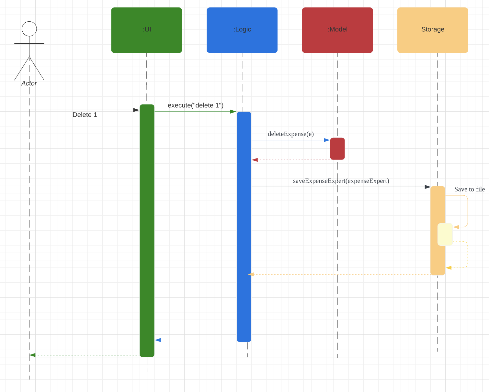

Each of the four main components (also shown in the diagram above),

- defines its _API_ in an `interface` with the same name as the Component.
- implements its functionality using a concrete `{Component Name}Manager` class (which follows the corresponding API `interface` mentioned in the previous point.

For example, the `Logic` component defines its API in the `Logic.java` interface and implements its functionality using the `LogicManager.java` class which follows the `Logic` interface. Other components interact with a given component through its interface rather than the concrete class (reason: to prevent outside component's being coupled to the implementation of a component), as illustrated in the (partial) class diagram below.

The sections below give more details of each component.

### UI component

The **API** of this component is specified in [`Ui.java`](https://github.com/AY2122S2-CS2103T-W09-3/tp/blob/master/src/main/java/seedu/address/ui/Ui.java)

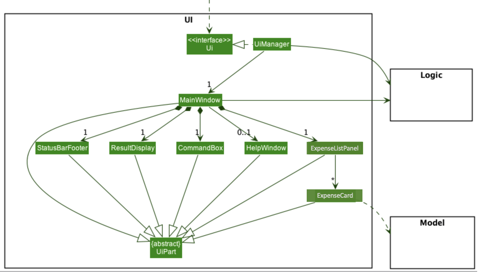

The UI consists of a `MainWindow` that is made up of parts e.g.`CommandBox`, `ResultDisplay`, `ExpenseListPanel`, `StatusBarFooter` etc. All these, including the `MainWindow`, inherit from the abstract `UiPart` class which captures the commonalities between classes that represent parts of the visible GUI.

The `UI` component uses the JavaFx UI framework. The layout of these UI parts are defined in matching `.fxml` files that are in the `src/main/resources/view` folder. For example, the layout of the [`MainWindow`](https://github.com/AY2122S2-CS2103T-W09-3/tp/blob/master/src/main/java/seedu/address/ui/MainWindow.java) is specified in [`MainWindow.fxml`](https://github.com/AY2122S2-CS2103T-W09-3/tp/blob/master/src/main/resources/view/MainWindow.fxml)

The `UI` component,

- executes user commands using the `Logic` component.
- listens for changes to `Model` data so that the UI can be updated with the modified data.
- keeps a reference to the `Logic` component, because the `UI` relies on the `Logic` to execute commands.
- depends on some classes in the `Model` component, as it displays `Person` object residing in the `Model`.

### Logic component

**API** : [`Logic.java`](https://github.com/AY2122S2-CS2103T-W09-3/tp/blob/master/src/main/java/seedu/address/logic/Logic.java)

Here's a (partial) class diagram of the `Logic` component:

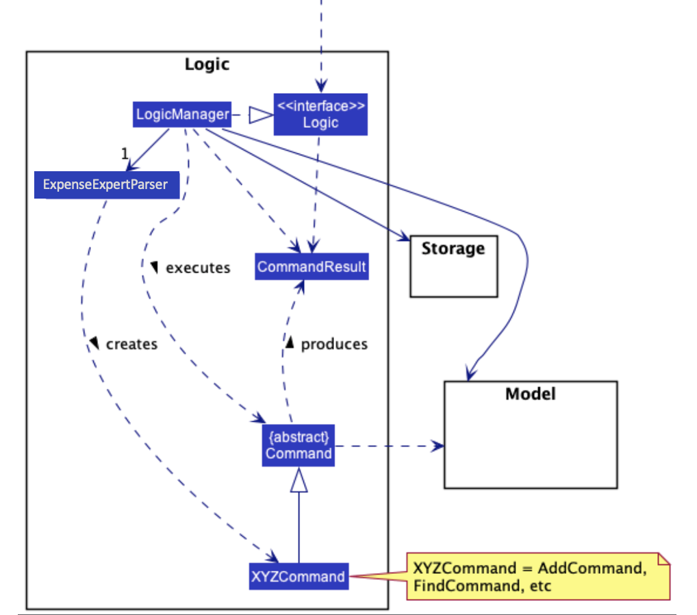

How the `Logic` component works:

1. When `Logic` is called upon to execute a command, it uses the `ExpenseExpertParser` class to parse the user command.
1. This results in a `Command` object (more precisely, an object of one of its subclasses e.g., `AddCommand`) which is executed by the `LogicManager`.
1. The command can communicate with the `Model` when it is executed (e.g. to add a expense).
1. The result of the command execution is encapsulated as a `CommandResult` object which is returned back from `Logic`.

The Sequence Diagram below illustrates the interactions within the `Logic` component for the `execute("delete 1")` API call.

:information_source: **Note:** The lifeline for `DeleteCommandParser` should end at the destroy marker (X) but due to a limitation of PlantUML, the lifeline reaches the end of diagram.

Here are the other classes in `Logic` (omitted from the class diagram above) that are used for parsing a user command:

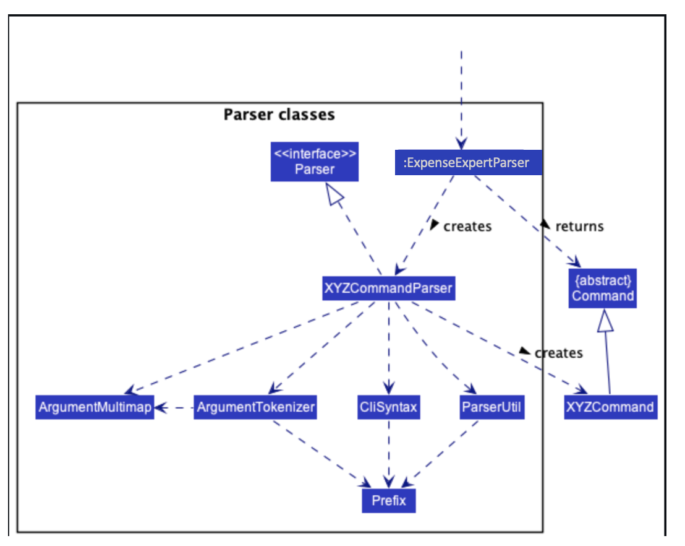

How the parsing works:

- When called upon to parse a user command, the `ExpenseExpertParser` class creates an `XYZCommandParser` (`XYZ` is a placeholder for the specific command name e.g., `AddCommandParser`) which uses the other classes shown above to parse the user command and create a `XYZCommand` object (e.g., `AddCommand`) which the `ExpenseExpertParser` returns back as a `Command` object.
- All `XYZCommandParser` classes (e.g., `AddCommandParser`, `DeleteCommandParser`, ...) inherit from the `Parser` interface so that they can be treated similarly where possible e.g, during testing.

### Model component

**API** : [`Model.java`](https://github.com/AY2122S2-CS2103T-W09-3/tp/blob/master/src/main/java/seedu/address/model/Model.java)

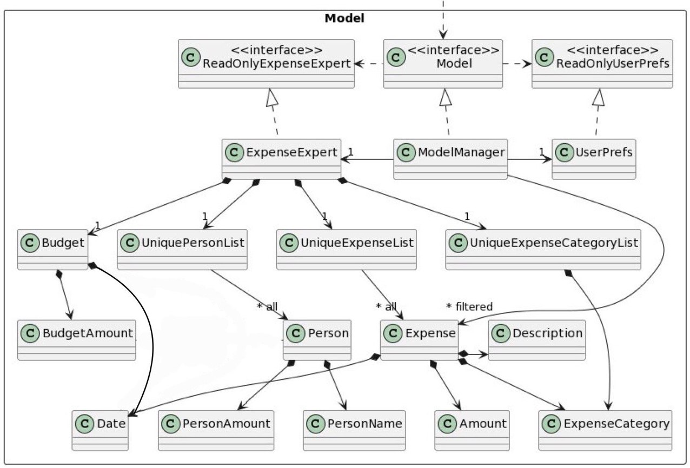

The `Model` component,

- stores the expense expert data. This includes `Expense` objects (which are contained in a `UniqueExpenseList` object), `Expense Category` objects (which are contained in a `UniqueExpenseCategoryList` object), `Persons` Objects (Which are contained in `UniquePersonList`) and a budget object.
- stores the currently 'selected' `Expense` objects (e.g., results of a search query) as a separate _filtered_ list which is exposed to outsiders as an unmodifiable `ObservableList<Expense>` that can be 'observed' e.g. the UI can be bound to this list so that the UI automatically updates when the data in the list change.
- stores all the `Person` objects as a separate _filtered_ list which is exposed to outsiders as an unmodifiable `ObservableList<Person>` that can be 'observed' e.g. the UI can be bound to this list so that the UI automatically updates when the data in the list change (Same implementation as `Expense` to allow future implementation of filtering of PersonList).
- stores a `UserPref` object that represents the user’s preferences. This is exposed to the outside as a `ReadOnlyUserPref` objects.
- does not depend on any of the other three components (as the `Model` represents data entities of the domain, they should make sense on their own without depending on other components)

### Storage component

**API** : [`Storage.java`](https://github.com/AY2122S2-CS2103T-W09-3/tp/blob/master/src/main/java/seedu/address/storage/Storage.java)

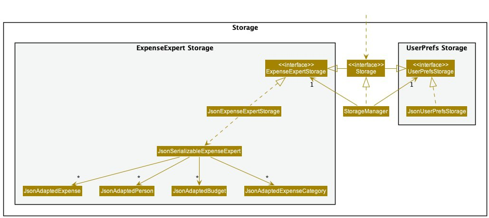

The `Storage` component,

- can save both Expense Expert data and user preference data in json format, and read them back into corresponding objects.
- Expense Expert Data consists of JSON-formatted Expenses, Persons, Budgets and Expense Categories.
- inherits from both `ExpenseExpertStorage` and `UserPrefStorage`, which means it can be treated as either one (if only the functionality of only one is needed).
- depends on some classes in the `Model` component (because the `Storage` component's job is to save/retrieve objects that belong to the `Model`)

### Common classes

Classes used by multiple components are in the `seedu.address.commons` package.

---

## **Implementation**

This section describes some noteworthy details on how certain features are implemented.

### **Filter**

Filter function allows user to filter the expense list based on date/month and/or category.

#### _How is the feature implemented?_

When user calls the filter command i.e. passing the text as command, the text will be parsed to `LogicManager` instance's `execute` method. `LogicManager` instance's execute method will
then call `ExpenseExpertParser` instance's `parseCommand` method. `ExpenseExpert` instance's pass command method will match the text parsed to find that it is a filter method and will then create a
`FilterCommandParser` object and call its instance's `parse` method with the argument(s) passed for the command i.e. the original text passed by user with the command word removed.

`FilterCommandParser` instance will then check and format the argument(s) passed. If the argument(s) parsed is invalid i.e. wrong format or missing fields, a `ParseException` with the error encountered will be thrown.
If the argument(s) is valid, `FilterCommandParser` will return control to `ExpenseExpertParser` with a new instance of `FilterCommand` (created with the properly formatted argument(s)). The `ExpenseExpertParser`
will also return control to `LogicManager` with the `FilterCommand` instance returned from `FilterCommandParser`.

Upon receiving control from `ExpenseExpertParser` with `FilterCommand` instance, `LogicManager` will proceed to call `FilterCommand` instance's execute method with `Model` of `ExpenseExpert` passed as argument.
By calling the `FilterCommand` instance's execute method, the control is passed to `FilterCommand`. `FilterCommand` instance will check its field for `ExpenseDateIsParsedDatePredicate` and
`ExpenseCategoryIsParsedCategoryPredicate` presence. If both fields are present, `FilterCommand` will create a new instance of `PredicateChain` with both fields parsed as argument. `PredicateChain`
functions like a predicate, but incorporates all the predicates in question.

If only one field is present, `FilterCommand` will proceed to filter `Model` instance's `updateFilteredExpenseList` method with that field to update the list to be shown to the user. If both fields
are present, `PredicateChain` created using both fields are used instead. Upon successfully execution, a `CommandResult` with the details to display to user after execution is returned to `LogicManager`.
`LogicManager` will then save the state of the `Model` and return the `CommandResult` to the UI side to display the result after execution.

The sequence diagram below illustrates the process of calling `filter ft/2022-03-3` successfully:

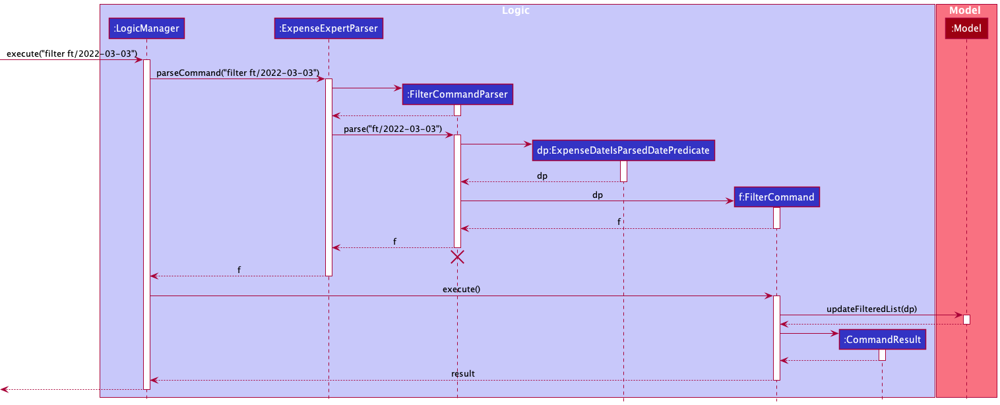

#### _Why is it implemented this way_

It is implemented using the Object-Oriented Programming approach so that it allows for easy future scaling. Such is done by grouping similar functionalities into different classes.

#### _Alternatives considered_

- `PredicateChain` to be specially created for combining only `ExpenseDateIsParsedDatePredicate` and `ExpenseCategoryIsParsedCategoryPredicate`.
  - This consideration is dropped as current implementation allows for future scaling, in the case where more filtering options are provided to users.

### **Navigating through command history**

In Expense Expert GUI, when the user presses up (or down) arrow key in the input text box, the user will be able to see the previous (or next) command if it exists. If not, the user will just see an empty text box.

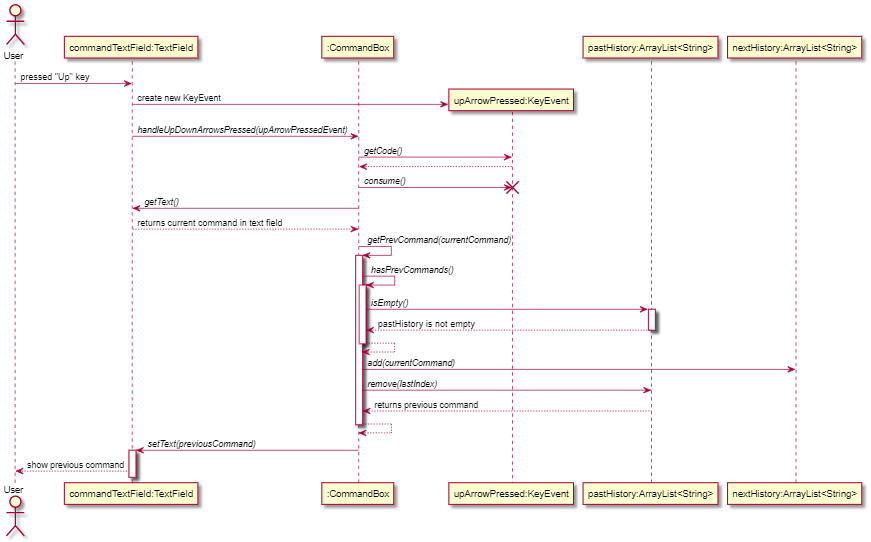
Above is the sequence diagram when a user presses up arrow in the input text box.

#### _How is the feature implemented?_

`CommandBox` keeps two ArrayLists of Strings, one to store the commands inputted before the current command, and one to store the commands inputted after the current command.

When the user presses the up or down arrow keys when the `CommandBox` is in focus, Expense Expert will recognise a KeyEvent where a key is pressed and call the private `handleUpDownArrowsPressed` method in `CommandBox`.

When the `handleUpDownArrowsPressed` method is called, the key code associated with the key pressed in the KeyEvent passed into the method is obtained through the instance method `getCode` of the KeyEvent passed in.

If the key code obtained is the same as that associated with a KeyEvent of an Up arrow key being pressed, another private method `getPrevCommand` in `CommandBox` will be called. In `getPrevCommand`, the ArrayList containing all past commands will be checked, and if it is not empty, the current command will be added to the ArrayList containing all future commands, and the most recent past command will be returned to the user in the `CommandBox`. If the former ArrayList is empty, then an empty String will be returned to the user.

If the key code obtained is the same as that associated with a KeyEvent of a Down arrow key being pressed, another private method `getNextCommand` in `CommandBox` will be called. `getNextCommand` is implemented very similarly to `getPrevCommand`, with the ArrayList involved swapping roles.

#### _Why is it implemented this way_

Separate ArrayLists were used to very distinctly keep the past commands separate from the future commands, hence it is very simple and intuitive. If the user needs a past command and pressed the Up arrow key, Expense Expert will get the most recent past command from the ArrayList containing past commands and vice versa.

#### _Alternatives considered_

Using of a combined ArrayList for all commands and navigating through the ArrayList by an index - This alternative, although making use of only one ArrayList, may be complicated to implement and makes debugging process very tedious. To avoid making this implementation complex, separate ArrayLists for keeping past commands and future commands were used.

### **Adding a person to the person list**

This feature is to allow the user to add a person to the list of people who owe them money. This is facilitated by the use
of the `person` command.

#### _How is the feature implemented?_

PersonOwedCommand class

The PersonOwedCommand class extends the Command class. It facilitates the addition of a `Person` object into the Person list, with the amount that the particular person
owes to the user. The command word to be parsed by the parser is a `String` and `String`s for successful execution of the command, 
for checks on the input by the user, and other parameters of the command.

The execute method in Command is overridden here in PersonOwesCommand. We represent a type of defensive programming here, by keeping a check that the model input in non-null. It also keeps a check for duplication of users to ensure that there are no duplicate users in the person list.
It only adds a person to the list if the person is unique. Relevant exceptions are thrown at relevant places in the cases of an invalid input by the user.

PersonOwedCommandParser class

The PersonOwedCommandParser class is an implementation of the Parser<PersonOwedCommand> interface. It is used to manage the parsing of the inputs provided by the user. 
The parse method in this class parses the `PersonName` and `PersonAmount` accordingly to convert these into attributes of a `Person` object and thus, create a new `Person` object. 
It then returns a `PersonOwedCommand` to`ExpenseExpertParser`, initialized with a new `Person`.

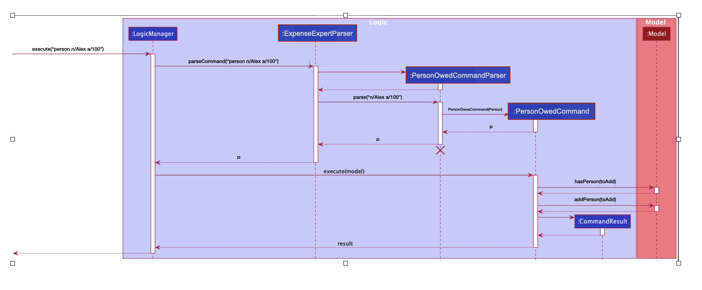

#### _Why is it implemented this way_

It allows for easy future scaling since it is implemented using Object-Oriented Programming. Similar functionalities are grouped together into similar classes.

#### _Alternatives considered_
 
This feature was built upon the existing functionalities of the app with the aim to make the app better. 
The implementation was straight forward and hence, no alternatives were considered.
  
### **Updating the amount of a person**

Update function allows user to update the amount associated with an existing person on the person list. 

#### _How is the feature implemented?_

When user calls the update command i.e. passing the text as command, the text will be parsed to `LogicManager` instance's `execute` method. `LogicManager` instance's execute method will
then call `ExpenseExpertParser` instance's `parseCommand` method. `ExpenseExpert` instance's pass command method will match the text parsed to find that it is an update method and will then create a
`EditPersonCommandParser` object and call its instance's `parse` method with the argument(s) passed for the command i.e. the original text passed by user with the command word removed.

`EditPersonCommandParser` instance will then check and format the argument(s) passed. If the argument(s) parsed is invalid i.e. wrong format or missing fields, a `ParseException` with the error encountered will be thrown.
If the argument(s) is valid, `EditPersonCommandParser` will return control to `ExpenseExpertParser` with a new instance of `EditPersonCommand` (created with the properly formatted argument(s)). The `ExpenseExpertParser`
will also return control to `LogicManager` with the `EditPersonCommand` instance returned from `EditPersonCommandParser`.

Upon receiving control from `ExpenseExpertParser` with `EditPersonCommand` instance, `LogicManager` will proceed to call `EditPersonCommand` instance's execute method with `Model` of `ExpenseExpert` passed as argument.
By calling the `EditPersonCommand` instance's execute method, the control is passed to `EditPersonCommand`. `EditPersonCommand` instance will check its field for `Amount` presence. If the field are present, `EditPersonCommand` will create a new instance of `Predicate_show_all_persons` with the field parsed as argument. `PredicateChain`
functions like a predicate, but incorporates all the predicates in question.

If both the field is present, `Predicate_show_all_persons` created using the field is used. Upon successfully execution, a `CommandResult` with the details to display to user after execution is returned to `LogicManager`.
`LogicManager` will then save the state of the `Model` and return the `CommandResult` to the UI side to display the result after execution.

The sequence diagram below illustrates the process of calling `update 1 a/100` successfully:

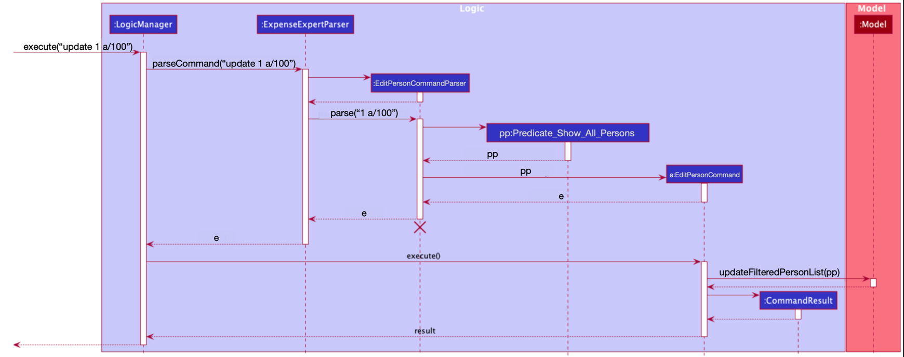

#### _Why is it implemented this way_

It is implemented using the Object-Oriented Programming approach so that it allows for easy future scaling. Such is done by grouping similar functionalities into different classes.

#### _Alternatives considered_

- `Predicate_show_all_persons` to be specially created for combining only `Amount`.
    - This consideration is dropped as current implementation allows for future scaling, in the case where more filtering options are provided to users.

### **Getting Help**

#### Implementation

While implementing the help command, the following classes were created/modified :

| Logic             | Ui         |
|-------------------|------------|
| HelpCommand       | HelpWindow |
| HelpCommandParser |            |

The main idea behind the implementation of this command is that, while using the app, the user may
request for help on how to use a particular command, what are the arguments expected by a particular commands and/or 
what is the expected syntax for the command.

It is implemented to be used in any of the following two ways:
1. The user can just enter the help command in the command box. This will pop up a help window which has all the necessary
details regarding the existing commands in the app.
2. Secondly, if the user wishes to know the usage of a particular command, they can enter the `help` command, followed by the `COMMAND_WORD`
for which they request the usage. This will result in the command usage for that said command being displayed.

The following diagram will give a better understanding of the execution of the help command:

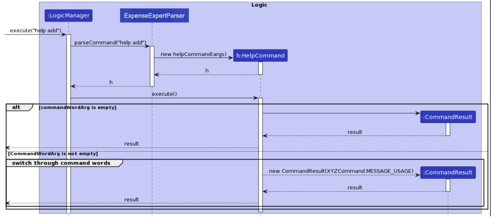

#### Design considerations:

**Aspect: Motivation**

There had been many cases in our initial user survey where the users were finding it hard to remember all the commands.
Hence, the team came up with a solution of the `help` command. This command allows the user to check the usage of all commands or
one particular command easily and makes the usage of the app easier and more user-friendly.

**Aspect: Maintainability**

The `help` command is implemented in such a manner that whenever a new command is added to the application, it can easily be incorporated to the `help` command's functionality.
Hence, it is extremely easy to maintain.

**Aspect: Robustness**

Intense checking has been done to ensure than the `help` command can handle invalid inputs. Proper error handling has 
been done to avoid mishandling of the command.

### **AddCat Command**

AddCat command allows user to define a new expense category which can be used to tag to an expense.

#### _How is the feature implemented?_

When user calls the AddCat command i.e. passing the text as command, the text will be parsed to `LogicManager` instance's `execute` method. `LogicManager` instance's execute method will
then call `ExpenseExpertParser` instance's `parseCommand` method. `ExpenseExpert` instance's pass command method will match the text parsed to find that it is a filter method and will then create a
`AddCategoryCommandParser` object and call its instance's `parse` method with the argument(s) passed for the command i.e. the original text passed by user with the command word removed.

`AddCategoryCommandParser` instance will then check and format the argument(s) passed. If the argument(s) parsed is invalid i.e. wrong format or missing fields, a `ParseException` with the error encountered will be thrown.
If the argument(s) is valid, `FilterCommandParser` will return control to `ExpenseExpertParser` with a new instance of `AddCategoryCommand` (created with the properly formatted argument(s)). The `ExpenseExpertParser`
will also return control to `LogicManager` with the `AddCategoryCommand` instance returned from `AddCategoryCommandParser`.

Upon receiving control from `ExpenseExpertParser` with `AddCategoryCommand` instance, `LogicManager` will proceed to call `AddCategoryCommand` instance's execute method with `Model` of `ExpenseExpert` passed as argument.
By calling the `AddCategoryCommand` instance's execute method, the control is passed to `AddCategoryCommand`. `AddCategoryCommand` instance will check its field for `ExpenseCategoryIsParsedCategoryPredicate` presence. 

`AddCategoryCommand` will proceed to invoke `Model` instance's `hasExpenseCategory` method with that field to check if a similar expense category exists. If `hasExpenseCategory` returns true, a `CommandException` with a duplicate expense message is thrown. 
Upon successfully execution of `AddCategoryCommand`, a `CommandResult` with the details to display to user after execution is returned to `LogicManager`.
The UI will then display the `CommandResult` after execution.

The sequence diagram below illustrates the process of calling `addCat c/Food` successfully:

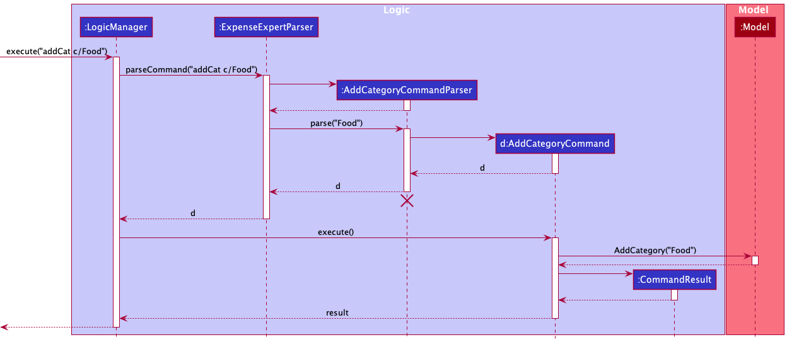

#### _Why is it implemented this way_

It is implemented using the Object-Oriented Programming approach so that it allows for easy future scaling. Such is done by grouping similar functionalities into different classes. This ensures that users only use categories which are predefined to allow for future manipulation of expenses by expense categories to be faster and simpler.

### **ListCat Command**

ListCat command allows user to define a see all predefined expense categories.

#### _How is the feature implemented?_

When user calls the ListCat command i.e. passing the text as command, the text will be parsed to `LogicManager` instance's `execute` method. `LogicManager` instance's execute method will
then call `ExpenseExpertParser` instance's `parseCommand` method. `ExpenseExpert` instance's pass command method will match the text parsed to find that it is a filter method and will then create a
`ListCatCommand` object.

Upon receiving control from `ExpenseExpertParser` with `ListCatCommand` instance, `LogicManager` will proceed to call `ListCatCommand` instance's execute method with `Model` of `ExpenseExpert` passed as argument.
By calling the `ListCatCommand` instance's execute method, the control is passed to `ListCatCommand`. 

`ListCatCommand` will proceed to invoke `Model` instance's `getFilteredExpenseCategoryList` method. The returned `expenseCategoryList` is then formatted and returned. 
Upon successfully execution of `ListCatCommand`, a `CommandResult` with the list of defined expense Categories are displayed to user after execution is returned to `LogicManager`.
The UI will then display the `CommandResult` after execution.

The sequence diagram below illustrates the process of calling `listCat` successfully:

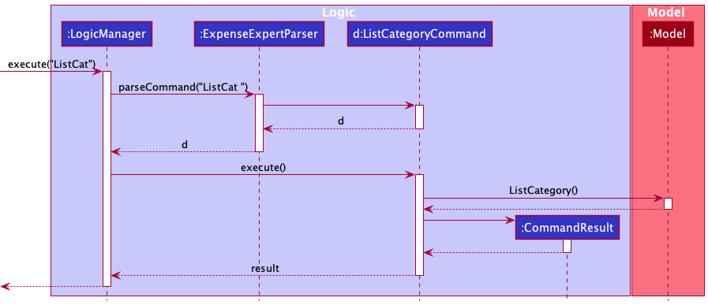

---

## **Documentation, logging, testing, configuration, dev-ops**

- [Documentation guide](Documentation.md)
- [Testing guide](Testing.md)
- [Logging guide](Logging.md)
- [Configuration guide](Configuration.md)
- [DevOps guide](DevOps.md)

---

## **Appendix: Requirements**

### Product scope

**Target user profile**:

- wants to manage and track expenses
- prefer desktop apps over other types
- can type fast
- prefers typing to mouse interactions
- is reasonably comfortable using CLI apps

**Value proposition**: manage expenses faster than a typical mouse/GUI driven app

### User stories

Priorities: High (must have) - `* * *`, Medium (nice to have) - `* *`, Low (unlikely to have) - `*`

| Priority | As a …​  | I want to …​                                                  | So that I can…​                                                         |
| -------- | -------- | ------------------------------------------------------------- | ----------------------------------------------------------------------- |
| `* * *`  | new user | see usage instructions                                        | try features suitable for new users                                     |
| `* * *`  | user     | add an expense with details such as type of expense           |                                                                         |
| `* * *`  | user     | delete an expense                                             | remove entries that I keyed wrongly                                     |
| `* * *`  | user     | edit an expense along with its details                        |                                                                         |
| `* * *`  | user     | view all expense recorded                                     | locate details of expenses without having to go through the entire list |
| `* *`    | user     | set expense categories                                        | track my spending habits                                                |
| `* *`    | user     | view all expense categories set                               | know which categories i can put expenses under                          |
| `* *`    | user     | find an expense base on keyword(s)                            |                                                                         |
| `* *`    | user     | filter expenses based on date/month and/or category           |                                                                         |
| `* *`    | user     | set a monthly budget                                          | keep track of my savings and over-expenditure                           |
| `* *`    | user     | be reminded to set a monthly budget when it is not set yet    | keep track of my expenses for the month relative to my budget           |
| `* *`    | user     | scroll through the commands I have issued Expense Expert      | quickly reenter a new command by editing a past command                 |
| `* *`    | user     | add people who owe me money along with the amount owed        |                                                                         |
| `* *`    | user     | remove people who owe me money along with the amount returned | track when they have paid me back                                       |
| `* *`    | user     | see which people owe me money                                 |                                                                         |

### Use cases

(For all use cases below, the **System** is the `Expense Expert` and the **Actor** is the `user`, unless specified otherwise)

**Use case: UC01 Add an expense**

**MSS**

1. User requests to add an expense.
2. User supplies the expense details.
3. Expense Expert adds the expense to the list.

   Use case ends.

**Extensions**

    2a. Expense Expert detects an error in details parsed.
        2a1. Expense Expert informs the user about the error detected.
        Use case ends.

    3a. Expense Expert detects that budget has not been set.
        3a1. Expense Expert informs the user to set a budget before executing other commands.
        Use case ends.

    3b. Expense parsed is a duplicate of another expense that is already in Expense Expert.
        3b1. Expense Expert informs the user that the expense already exists in Expense Expert.
        Use case ends.

**Use case: UC02 Delete an expense**

**MSS**

1. User requests to delete an expense.
2. User supplies the expense detail.
3. Expense Expert deletes the expense from the list.

   Use case ends.

**Extensions**

    2a. Expense Expert detects an error in details parsed.
        2a1. Expense Expert informs the user about the error detected.
        Use case ends.

    3a. Expense Expert detects that budget has not been set.
        3a1. Expense Expert informs the user to set a budget before executing other commands.
        Use case ends.

    3b. List of Expenses is empty
        3b1. Expense Expert informs the user that there is no expense in the list.
        Use case ends.

**Use case: UC03 Edit an expense**

**MSS**

1. User requests to edit an expense.
2. User supplies the details of the expenses to be edited.
3. Expense Expert edits the expense in the list.

   Use case ends.

**Extensions**

    2a. Expense Expert detects an error in details parsed.
        2a1. Expense Expert informs the user about the error detected.
        Use case ends.

    3a. Expense Expert detects that budget has not been set.
        3a1. Expense Expert informs the user to set a budget before executing other commands.
        Use case ends.

    3b. Expense Expert detects that the details of the newly edited expense is a duplicate of another expense in the list.
        3b1. Expense Expert informs the user that expense edited is a duplicate of another expense in Expense Expert.
        Use case ends.

**Use case: UC04 Categorise Expense(s)**

**MSS**

1. User defines expense categories.
2. User tags expenses with expense categories.

   Use case ends.

**Extensions**

    1a. Expense Expert detects that expense category attempted to be defined already exists.
        3a1. Expense Expert informs the user about the error detected.
        Use case ends.

    2a. Expense Expert detects when a user inputs an undefined category.
        2a1. Expense Expert informs the user about the error detected.
        Use case ends.

    2b. Expense Expert detects that expense category has not been set.
        2b1. Expense Expert defaults the expense category to 'General'.

**Use case: UC05 Find expense(s)**

**MSS**

1. User requests to find a/some particular expense(s) through keyword(s).
2. User supplies the keyword(s).
3. Expense Expert finds the expenses accordingly.

   Use case ends.

**Extensions**

    2a. Expense Expert detects errors in keyword(s) parsed.
        2a1. Expense Expert informs the user about the error detected.
        Use case ends.

    3a. Expense Expert can't find any matches.
        3a1. Expense Expert returns an empty list to the user
        Use case ends.

    3b. Expense Expert detects that budget has not been set.
        3b1. Expense Expert informs the user to set a budget before executing other commands.
        Use case ends.

**Use case: UC06 Help the user**

**MSS**

1. User requests to know how to use the system.
2. Expense Expert helps the user accordingly.

   Use case ends.

**Use case: UC07 Clear Expense Expert**

**MSS**

1. User requests to clear all the expenses added until then.
2. Expense Expert is cleared and is then empty.

   Use case ends.

**Use case: UC08 Set Monthly Budget**

**MSS**

1. User requests to set a monthly budget.
2. User supplies details of monthly budget.
3. Expense Expert sets a monthly budget for the user.

   Use case ends.

**Extensions**

    2a. Expense Expert detects errors in details of monthly budget.
        2a1. Expense Expert informs the user about the error detected.
        Use case ends.

**Use case: UC09 Filter expense(s)**

**MSS**

1. User requests to filter the expense list.
2. User supplies filter criteria.
3. Expense Expert filters the expense(s) accordingly.

   Use case ends.

**Extensions**

    2a. Expense Expert detects errors in filter criteria.
        2a1. Expense Expert informs the user about the error detected.
        Use case ends.

    3b. Expense Expert detects that budget has not been set.
        3b1. Expense Expert informs the user to set a budget before executing other commands.
        Use case ends.

**Use case: UC10 Exit Expense Expert**

**MSS**

1. User requests to exit the app.
2. Expense Expert exits.

   Use case ends.

### Non-Functional Requirements

1.  Should work on any _mainstream OS_ as long as it has Java `11` or above installed.
2.  Should be able to hold up to 1000 expenses without a noticeable sluggishness in performance for typical usage.
3.  A user with above average typing speed for regular English text (i.e. not code, not system admin commands) should be able to accomplish most of the tasks faster using commands than using the mouse.
4.  Should not require an internet connection.

### Glossary

- **API**: Application Programming Interface, which is a set of definitions and protocols for building and integrating application software.
- **Expense**: The action of spending funds.
- **GUI**: Graphical User Interface, a form of user interface that allows users to interact with programs through graphical icons and audio indicators.
- **Mainstream OS**: Windows, Linux, Unix, OS-X.
- **Private contact detail**: A contact detail that is not meant to be shared with others.
- **Sequence Diagram**: A diagram that describes how, and in what order, a group of objects work together.

---

## **Appendix: Instructions for manual testing**

Given below are instructions to test the app manually.

:information_source: **Note:** These instructions only provide a starting point for testers to work on;
testers are expected to do more *exploratory* testing.

### Launch and shutdown

1. Initial launch

   1. Download the jar file and copy into an empty folder

   1. Double-click the jar file Expected: Shows the GUI with a set of sample contacts. The window size may not be optimum.

1. Saving window preferences

   1. Resize the window to an optimum size. Move the window to a different location. Close the window.

   1. Re-launch the app by double-clicking the jar file. 
      Expected: The most recent window size and location is retained.

1. Shutdown

   1. Enter the command `exit`.

### Adding an expense

1. Deleting a expense while all expenses are being shown

   1. Prerequisites: List all expenses using the `list` command. Multiple expenses in the list.

   1. Test case: `delete 1` 
      Expected: First contact is deleted from the list. Details of the deleted contact shown in the status message. Timestamp in the status bar is updated.

   1. Test case: `delete 0` 
      Expected: No expense is deleted. Error details shown in the status message. Status bar remains the same.

   1. Other incorrect delete commands to try: `delete`, `delete x`, `...` (where x is larger than the list size) 
      Expected: Similar to previous.

### Deleting an expense

1. Deleting a expense while all expenses are being shown

   1. Prerequisites: List all expenses using the `list` command. Multiple expenses in the list.

   1. Test case: `delete 1` 
      Expected: First contact is deleted from the list. Details of the deleted contact shown in the status message. Timestamp in the status bar is updated.

   1. Test case: `delete 0` 
      Expected: No expense is deleted. Error details shown in the status message. Status bar remains the same.

   1. Other incorrect delete commands to try: `delete`, `delete x`, `...` (where x is larger than the list size) 
      Expected: Similar to previous.

