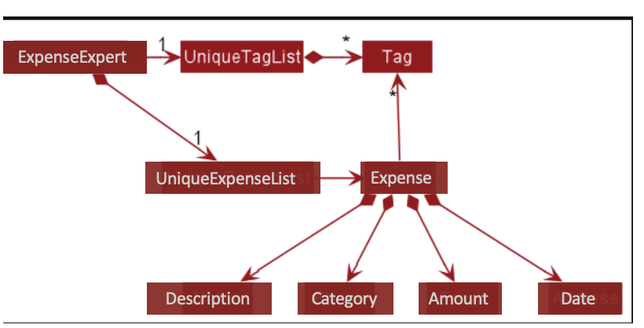

* Table of Contents
{:toc}

--------------------------------------------------------------------------------------------------------------------

## **Acknowledgements**

* This project is based on the AddressBook-Level3 project created by the [SE-EDU initiative](https://se-education.org).

--------------------------------------------------------------------------------------------------------------------

## **Setting up, getting started**

Refer to the guide [_Setting up and getting started_](SettingUp.md).

--------------------------------------------------------------------------------------------------------------------

## **Design**

:bulb: **Tip:** The `.puml` files used to create diagrams in this document can be found in the [diagrams](https://github.com/se-edu/addressbook-level3/tree/master/docs/diagrams/) folder. Refer to the [_PlantUML Tutorial_ at se-edu/guides](https://se-education.org/guides/tutorials/plantUml.html) to learn how to create and edit diagrams.

### Architecture

The ***Architecture Diagram*** given above explains the high-level design of the App.

Given below is a quick overview of main components and how they interact with each other.

**Main components of the architecture**

**`Main`** has two classes called [`Main`](https://github.com/AY2122S2-CS2103T-W09-3/tp/blob/master/src/main/java/seedu/address/Main.java) and [`MainApp`](https://github.com/AY2122S2-CS2103T-W09-3/tp/blob/master/src/main/java/seedu/address/MainApp.java). It is responsible for,
* At app launch: Initializes the components in the correct sequence, and connects them up with each other.
* At shut down: Shuts down the components and invokes cleanup methods where necessary.

[**`Commons`**](#common-classes) represents a collection of classes used by multiple other components.

The rest of the App consists of four components.

* [**`UI`**](#ui-component): The UI of the App.
* [**`Logic`**](#logic-component): The command executor.
* [**`Model`**](#model-component): Holds the data of the App in memory.
* [**`Storage`**](#storage-component): Reads data from, and writes data to, the hard disk.

**How the architecture components interact with each other**

The *Sequence Diagram* below shows how the components interact with each other for the scenario where the user issues the command `delete 1`.

Each of the four main components (also shown in the diagram above),

* defines its *API* in an `interface` with the same name as the Component.
* implements its functionality using a concrete `{Component Name}Manager` class (which follows the corresponding API `interface` mentioned in the previous point.

For example, the `Logic` component defines its API in the `Logic.java` interface and implements its functionality using the `LogicManager.java` class which follows the `Logic` interface. Other components interact with a given component through its interface rather than the concrete class (reason: to prevent outside component's being coupled to the implementation of a component), as illustrated in the (partial) class diagram below.

The sections below give more details of each component.

### UI component

The **API** of this component is specified in [`Ui.java`](https://github.com/AY2122S2-CS2103T-W09-3/tp/blob/master/src/main/java/seedu/address/ui/Ui.java)

The UI consists of a `MainWindow` that is made up of parts e.g.`CommandBox`, `ResultDisplay`, `ExpenseListPanel`, `StatusBarFooter` etc. All these, including the `MainWindow`, inherit from the abstract `UiPart` class which captures the commonalities between classes that represent parts of the visible GUI.

The `UI` component uses the JavaFx UI framework. The layout of these UI parts are defined in matching `.fxml` files that are in the `src/main/resources/view` folder. For example, the layout of the [`MainWindow`](https://github.com/AY2122S2-CS2103T-W09-3/tp/blob/master/src/main/java/seedu/address/ui/MainWindow.java) is specified in [`MainWindow.fxml`](https://github.com/AY2122S2-CS2103T-W09-3/tp/blob/master/src/main/resources/view/MainWindow.fxml)

The `UI` component,

* executes user commands using the `Logic` component.
* listens for changes to `Model` data so that the UI can be updated with the modified data.
* keeps a reference to the `Logic` component, because the `UI` relies on the `Logic` to execute commands.
* depends on some classes in the `Model` component, as it displays `Person` object residing in the `Model`.

### Logic component

**API** : [`Logic.java`](https://github.com/AY2122S2-CS2103T-W09-3/tp/blob/master/src/main/java/seedu/address/logic/Logic.java)

Here's a (partial) class diagram of the `Logic` component:

How the `Logic` component works:
1. When `Logic` is called upon to execute a command, it uses the `ExpenseExpertParser` class to parse the user command.
1. This results in a `Command` object (more precisely, an object of one of its subclasses e.g., `AddCommand`) which is executed by the `LogicManager`.
1. The command can communicate with the `Model` when it is executed (e.g. to add a expense).
1. The result of the command execution is encapsulated as a `CommandResult` object which is returned back from `Logic`.

The Sequence Diagram below illustrates the interactions within the `Logic` component for the `execute("delete 1")` API call.

:information_source: **Note:** The lifeline for `DeleteCommandParser` should end at the destroy marker (X) but due to a limitation of PlantUML, the lifeline reaches the end of diagram.

Here are the other classes in `Logic` (omitted from the class diagram above) that are used for parsing a user command:

How the parsing works:
* When called upon to parse a user command, the `ExpenseExpertParser` class creates an `XYZCommandParser` (`XYZ` is a placeholder for the specific command name e.g., `AddCommandParser`) which uses the other classes shown above to parse the user command and create a `XYZCommand` object (e.g., `AddCommand`) which the `ExpenseExpertParser` returns back as a `Command` object.
* All `XYZCommandParser` classes (e.g., `AddCommandParser`, `DeleteCommandParser`, ...) inherit from the `Parser` interface so that they can be treated similarly where possible e.g, during testing.

### Model component
**API** : [`Model.java`](https://github.com/AY2122S2-CS2103T-W09-3/tp/blob/master/src/main/java/seedu/address/model/Model.java)

The `Model` component,

* stores the expense expert data i.e., all `Expense` objects (which are contained in a `UniqueExpenseList` object).
* stores the currently 'selected' `Expense` objects (e.g., results of a search query) as a separate _filtered_ list which is exposed to outsiders as an unmodifiable `ObservableList<Expense>` that can be 'observed' e.g. the UI can be bound to this list so that the UI automatically updates when the data in the list change.
* stores a `UserPref` object that represents the user’s preferences. This is exposed to the outside as a `ReadOnlyUserPref` objects.
* does not depend on any of the other three components (as the `Model` represents data entities of the domain, they should make sense on their own without depending on other components)

:information_source: **Note:** An alternative (arguably, a more OOP) model is given below. It has a `Tag` list in the `ExpenseExpert`, which `Expense` references. This allows `ExpenseExpert` to only require one `Tag` object per unique tag, instead of each `Expense` needing their own `Tag` objects. 

### Storage component

**API** : [`Storage.java`](https://github.com/AY2122S2-CS2103T-W09-3/tp/blob/master/src/main/java/seedu/address/storage/Storage.java)

The `Storage` component,
* can save both address book data and user preference data in json format, and read them back into corresponding objects.
* inherits from both `ExpenseExpertStorage` and `UserPrefStorage`, which means it can be treated as either one (if only the functionality of only one is needed).
* depends on some classes in the `Model` component (because the `Storage` component's job is to save/retrieve objects that belong to the `Model`)

### Common classes

Classes used by multiple components are in the `seedu.address.commons` package.

--------------------------------------------------------------------------------------------------------------------

## **Implementation**

This section describes some noteworthy details on how certain features are implemented.

#### Design considerations:

_{more aspects and alternatives to be added}_

### \[Proposed\] Data archiving

_{Explain here how the data archiving feature will be implemented}_

--------------------------------------------------------------------------------------------------------------------

## **Documentation, logging, testing, configuration, dev-ops**

* [Documentation guide](Documentation.md)
* [Testing guide](Testing.md)
* [Logging guide](Logging.md)
* [Configuration guide](Configuration.md)
* [DevOps guide](DevOps.md)

--------------------------------------------------------------------------------------------------------------------

## **Appendix: Requirements**

### Product scope

**Target user profile**:

* wants to manage and track expenses
* prefer desktop apps over other types
* can type fast
* prefers typing to mouse interactions
* is reasonably comfortable using CLI apps

**Value proposition**: manage expenses faster than a typical mouse/GUI driven app

### User stories

Priorities: High (must have) - `* * *`, Medium (nice to have) - `* *`, Low (unlikely to have) - `*`

| Priority | As a …​  | I want to …​                                        | So that I can…​                                                         |
|----------|----------|-----------------------------------------------------|-------------------------------------------------------------------------|
| `* * *`  | new user | see usage instructions                              | try features suitable for new users                                     |
| `* * *`  | user     | add an expense with details such as type of expense |                                                                         |
| `* * *`  | user     | delete an expense                                   | remove entries that I keyed wrongly                                     |
| `* * *`  | user     | edit an expense along with its details              |                                                                         |
| `* * *`  | user     | view all expense recorded                           | locate details of expenses without having to go through the entire list |
| `* *`     | user     | find an expense base on keyword(s)                  |                                                                         |
| `* *`    | user     | filter expenses based on date/month and/or category |                                                                         |
| `* *`    | user     | set a monthly budget                                | keep track of my savings and over-expenditure                           |

*{More to be added}*

### Use cases

(For all use cases below, the **System** is the `ExpenseExpert` and the **Actor** is the `user`, unless specified otherwise)

**Use case: UC01 Add an expense**

**MSS**

1.  User requests to add an expense.
2.  ExpenseExpert adds the expense to the list.

    Use case ends.

**Extensions**

    1a. Invalid syntax entered.
        1a1. ExpenseExpert requests to check command parsed and enter command again.
        Use case ends.

    2a. Missing syntax or syntax field(s).
        2a1. ExpenseExpert requests to check command parsed and enter command again.
        Use case ends.

    3a. Expense parsed is already in ExpenseExpert.
        3a1. ExpenseExpert notifies user that expense already exist in ExpenseExpert.
        Use case ends.

**Use case: UC02 Delete an expense**

**MSS**
1. User requests to delete an expense.
2. Expense Expert deletes the expense from the list.

    Use case ends.

**Extensions**

    1a. Invalid expense entered.
        1a1. ExpenseExpert requests to check the expense to be deleted and enter command again.
        Use case ends.

    2a. Missing syntax or syntax field(s).
        2a1. ExpenseExpert request to check command parsed and enter command again.
        Use case ends.

    3a. List of Expenses is empty
        3a1. ExpenseExpert notifies the user that there exists no expense to delete
        Use case ends.

**Use case: UC03 Edit an expense**

**MSS**
1. User requests to edit an expense.
2. Expense Expert edits the expense in the list.

   Use case ends.

**Extensions**

    1a. Invalid expense entered.
        1a1. ExpenseExpert requests to check the expense parsed and enter command again.
        Use case ends.

    2a. Missing syntax or syntax field(s).
        2a1. ExpenseExpert request to check command parsed and enter command again.
        Use case ends.

    3a. Edited expense is a duplicate of another expense in ExpenseExpert.
        3a1. ExpenseExpert notify user that expense edited will duplicate of another expense in ExpenseExpert.
        Use case ends.

**Use case: UC04 Find expense(s)**

**MSS**
1. User requests to find a/some particular expense(s) through keywords.
2. Expense Expert finds the expenses accordingly.

   Use case ends.

**Extensions**

    1a. Invalid expense/keyword entered.
        1a1. ExpenseExpert requests to check the expense/keyword to be found and enter command again.
        Use case ends.

    2a. Missing syntax or syntax field(s).
        2a1. ExpenseExpert request to check command parsed and enter command again.
        Use case ends.

    3a. ExpenseExpert doesn't find any matches
        3a1. ExpenseExpert returns an empty list to the user
        Use case ends.

**Use case: UC05 Help the user**

**MSS**
1. User requests to know how to use the system.
2. Expense Expert helps the user accordingly.

   Use case ends.

**Extensions**

    1a. Invalid keyword entered.
        1a1. ExpenseExpert requests to check the keyword and enter command again.
        Use case ends.

**Use case: UC06 Clear ExpenseExpert**

**MSS**
1. User requests to clear all the expenses added until then.
2. Expense Expert is cleared and is then empty.

   Use case ends.

**Extensions**

    1a. Invalid keyword entered.
        1a1. ExpenseExpert requests to check the keyword and enter command again.
        Use case ends.

**Use case: UC07 Set Monthly Budget**

**MSS**
1. User requests to set a monthly budget.
2. Expense Expert sets a monthly budget for the user.

   Use case ends.

**Extensions**

    1a. Invalid budget entered.
        1a1. ExpenseExpert requests to check the budget amount parsed and enter command again.
        Use case ends.

    2a. Missing syntax or syntax field(s).
        2a1. ExpenseExpert request to check command parsed and enter command again.
        Use case ends.

    3a. Entered budget is empty
        3a1. ExpenseExpert notifies the user of the invalidity of the empty budget.
        Use case ends.

**Use case: UC08 Filter expense(s)**

**MSS**
1. User requests to filter the expense list.
2. Expense Expert sets a monthly budget for the user.

   Use case ends.

**Use case: UC09 Exit ExpenseExpert**

**MSS**
1. User requests to exit the app.
2. Expense Expert exits.

   Use case ends.

**Extensions**

    1a. Invalid keyword entered.
        1a1. ExpenseExpert requests to check the keyword and enter command again.
        Use case ends.

### Non-Functional Requirements

1.  Should work on any _mainstream OS_ as long as it has Java `11` or above installed.
2.  Should be able to hold up to 1000 expenses without a noticeable sluggishness in performance for typical usage.
3.  A user with above average typing speed for regular English text (i.e. not code, not system admin commands) should be able to accomplish most of the tasks faster using commands than using the mouse.
4.  Should not require an internet connection.

*{More to be added}*

### Glossary

* **Mainstream OS**: Windows, Linux, Unix, OS-X
* **Private contact detail**: A contact detail that is not meant to be shared with others
* **Expense**:the action of spending funds.

--------------------------------------------------------------------------------------------------------------------

## **Appendix: Instructions for manual testing**

Given below are instructions to test the app manually.

:information_source: **Note:** These instructions only provide a starting point for testers to work on;
testers are expected to do more *exploratory* testing.

### Launch and shutdown

1. Initial launch

   1. Download the jar file and copy into an empty folder

   1. Double-click the jar file Expected: Shows the GUI with a set of sample contacts. The window size may not be optimum.

1. Saving window preferences

   1. Resize the window to an optimum size. Move the window to a different location. Close the window.

   1. Re-launch the app by double-clicking the jar file. 
       Expected: The most recent window size and location is retained.

1. _{ more test cases …​ }_

### Deleting an expense

1. Deleting a expense while all expenses are being shown

   1. Prerequisites: List all expenses using the `list` command. Multiple expenses in the list.

   1. Test case: `delete 1` 
      Expected: First contact is deleted from the list. Details of the deleted contact shown in the status message. Timestamp in the status bar is updated.

   1. Test case: `delete 0` 
      Expected: No expense is deleted. Error details shown in the status message. Status bar remains the same.

   1. Other incorrect delete commands to try: `delete`, `delete x`, `...` (where x is larger than the list size) 
      Expected: Similar to previous.

1. _{ more test cases …​ }_

### Saving data

1. Dealing with missing/corrupted data files

   1. _{explain how to simulate a missing/corrupted file, and the expected behavior}_

1. _{ more test cases …​ }_
