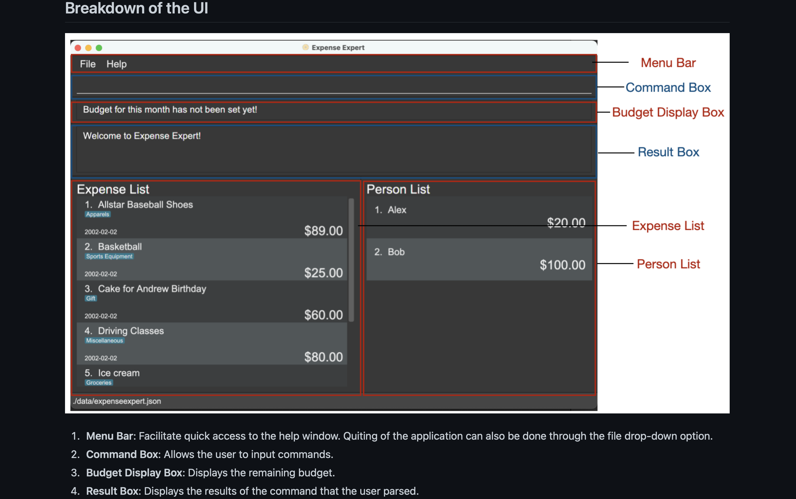

### Project: Expense Expert

Expense Expert is a desktop expense tracking application used for tracking one's personal expenses. The user interacts
with it using a CLI, and it has a GUI created with JavaFX. It is written in Java, and has about ~10 kLoC.
Given below are my contributions to the project.

- **New Feature**:

  - **Added a new `Person` object to the application with the following attributes:**
    - `PersonName`
    - `PersonAmount`

- **New Feature**:
  - **Add a new person to the list of people who owe you money**
  
    - What it does: A new list was created to keep track of the people who owe the user money. This feature allows the user
      to add people to it with the amount they owe them.
    - This was a new dimension to the application, which extended the capabilities of our app from just being an expense tracker
      to a financial manager.
    - This is done by the `person` command, and the parsing as well as testing was handled.
    - New classes were created accordingly.

- **New Feature**: 
  - **Removing a person from the list of people who had paid back the owed money**

    - What it does: From the list of people who owed the user money, this feature enables the removal of people who have
      paid the said money and hence, are to be removed
    - This was done by the "paid" command, and its parsing and testing were handled as well.
    - New classes were created accordingly.

- **Code contributed**: [RepoSense link](https://nus-cs2103-ay2122s2.github.io/tp-dashboard/?search=shivang211&breakdown=true)

- **Project management**: 
  - Managed the deliverables and timely completion of the project expectations.
  - Found bugs for the application.

- **Enhancements to existing features**: 
  - Added/refined testing to the following classes for better performance and exception handling :
    - `PersonOwesCommand`
    - `PersonOwesCommandParser`
    - `HelpCommand`
  - Significantly revamped the `help` command to handle multiple implementations.
  - Changed the UI of the help window to fit to the user needs better.
  - Added a new Person List to the UI for the better and more complete functioning of the application.
  - Upgraded the UI of the whole application significantly for a better user experience.

- **Documentation**:

  - User Guide:
    - Added/refined the following sections: 
      - `Person` Command
      - `Paid` Command
      - `Help` Command: added the Ui for the `help` command
      - Added the ui images for different command `filter`, f`ind`
    - Added Ui pictures and a breakdown of the UI.
      
  - Developer Guide:
    - Added the following implementation to the guide:
      - Getting help feature
      - Adding a person to the person list feature
      - Added a fair share of user stories
      - Added a fair share of use cases.

- **Community**:

  - PRs reviewed (with non-trivial review comments):[#88](https://github.com/AY2122S2-CS2103T-W09-3/tp/pull/88), [#91](https://github.com/AY2122S2-CS2103T-W09-3/tp/pull/91) [#115](https://github.com/AY2122S2-CS2103T-W09-3/tp/pull/115) [#142](https://github.com/AY2122S2-CS2103T-W09-3/tp/pull/142), 
  - Reported 8 bugs during the PE-D to the allocated team (see [here](https://github.com/Shivang211/ped/tree/main/files))
  
